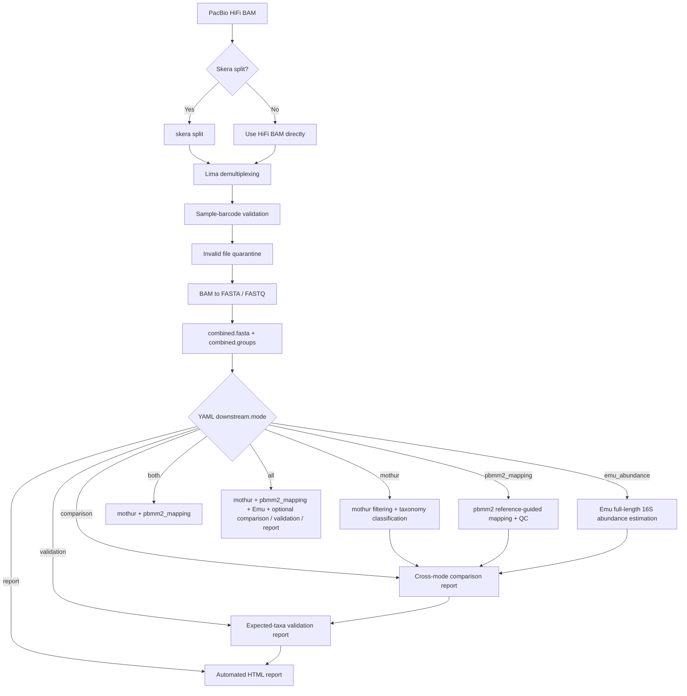

# PacBio Kinnex 16S-ITS-23S Microbiome Analysis Harness

[](https://github.com/tay45/PacBio_Kinnex_16S-ITS-23S_Microbiome_Analysis_Harness/actions/workflows/ci.yml)

Current release: `1.7.0` automated HTML report.

This repository is a reproducible analysis harness for PacBio Kinnex 16S-ITS-23S long-read amplicon microbiome data. It supports PacBio-specific preprocessing with Skera, Lima, `bam2fasta`, `bam2fastq`, and `samtools faidx`, followed by mothur-based sequence screening and taxonomy classification.

This is not a generic short-read 16S workflow. It is organized around PacBio Kinnex long-read amplicons and the barcode naming convention:

```text
Kinnex16S_Fwd_XX--Kinnex16S_Rev_YY
```

The downstream router supports mothur sequence filtering/classification, pbmm2 reference-guided mapping, Emu full-length 16S abundance estimation, cross-mode comparison reporting, and validation against user-provided expected taxa/reference tables.

## Architecture Summary

```text
PacBio preprocessing
-> YAML downstream router
-> mothur classification route
-> pbmm2 mapping/QC route
-> Emu abundance route
-> comparison report
-> validation report
```

## Architecture and downstream routing



### Downstream routing guide

| Mode            | Purpose                                                                                                        |
| --------------- | -------------------------------------------------------------------------------------------------------------- |
| `mothur`        | Runs configurable sequence filtering and taxonomy classification.                                              |
| `pbmm2_mapping` | Runs PacBio-native reference-guided alignment, mapping QC, and per-reference mapping-derived signal summaries. |
| `emu_abundance` | Runs Emu-based full-length 16S-compatible taxonomic abundance estimation.                                      |
| `comparison`    | Organizes available mothur, pbmm2_mapping, and Emu outputs for side-by-side review.                            |
| `validation`    | Compares observed method-specific outputs against a user-provided expected taxa or mock-community table.       |
| `report`        | Generates a portable automated HTML report from available comparison, validation, and QC outputs.              |
| `both`          | Runs `mothur` plus `pbmm2_mapping`.                                                                            |
| `all`           | Runs all major routes, with optional comparison, validation, and report generation when enabled in YAML.       |

> The downstream modes answer related but distinct questions. `mothur` supports filtering and taxonomy classification, `pbmm2_mapping` supports reference-guided alignment and mapping QC, and `emu_abundance` supports full-length 16S-compatible abundance estimation. The comparison, validation, and report layers organize outputs for review but do not replace expert biological interpretation.

## Workflow

1. Optionally run Skera split on the input PacBio HiFi BAM.
2. Demultiplex with Lima using Kinnex barcode FASTA records.
3. Validate demultiplexed BAM filenames and quarantine invalid or empty files.
4. Parse a comma- or tab-delimited sample sheet with `Barcode` and `Sample Name` columns.
5. Reject duplicate barcodes and duplicate sample names.
6. Convert valid demultiplexed BAM files to FASTA and/or FASTQ.
7. Index FASTA outputs with `samtools faidx` when FASTA conversion is requested.
8. Build `combined.fasta` and `combined.groups` for mothur when FASTA output exists.
9. Run mothur `summary.seqs`, `screen.seqs`, `classify.seqs`, and optional `remove.lineage`.
10. Optionally route downstream analysis to mothur, pbmm2 mapping, Emu abundance, comparison reporting, `both`, or `all` from YAML.

## Repository Layout

```text
README.md
LATEST.md
release_manifest.json
config/
  project.example.yaml
  database_profiles.example.yaml
docs/
  downstream_routing.md
  emu_abundance_mode.md
  pbmm2_mapping_mode.md
  cross_mode_comparison.md
  mock_community_validation.md
  reproducible_execution.md
  workflow_integration.md
  html_report.md
  mothur_options.md
  methods.md
  limitations.md
  validation_plan.md
src/kinnex16s/
  cli.py
  commands.py
  pacbio_preprocess.py
  barcode_validation.py
  fasta_group_builder.py
  mothur_runner.py
  pbmm2_runner.py
  emu_runner.py
  comparison_report.py
  validation_report.py
  downstream_router.py
  validators.py
scripts/
  run_preprocess.py
  run_mothur.py
tests/
workflows/
```

The original entry points remain available:

```text
16S_rRNA_Sequencing_Analysis.py
mothur_processing.py
```

## Dependencies

External command-line tools:

```text
skera
lima
bam2fasta
bam2fastq
samtools
mothur
pbmm2
emu
```

Python test dependency:

```text
pytest
```

See `environment.yml` and `module_setup.example.sh` for generic environment examples. Adjust module names and paths for your cluster or workstation.

## Sample Sheet

The sample sheet may be comma- or tab-delimited. Required columns are matched case-insensitively and tolerate extra whitespace:

```text
Barcode,Sample Name
Kinnex16S_Fwd_01--Kinnex16S_Rev_13,Sample_A
```

Duplicate barcodes and duplicate sample names are rejected so downstream group assignments remain unambiguous.

## Preprocessing Example

```bash
python3 16S_rRNA_Sequencing_Analysis.py \
  --input-bam data/movie.hifi_reads.bam \
  --skip-skera \
  --barcodes-fasta refs/Kinnex_16S_384-plex_primers.fasta \
  --output-dir results/preprocess \
  --barcode-type asymmetric \
  --sample-barcode-csv config/sample_barcode.csv \
  --convert-types fasta fastq \
  --compression-level 1
```

When Skera splitting is needed, omit `--skip-skera` and provide `--adapters-fasta`:

```bash
python3 16S_rRNA_Sequencing_Analysis.py \
  --input-bam data/movie.hifi_reads.bam \
  --adapters-fasta refs/Kinnex_16S_Adapter_v2_MAS12.fasta \
  --barcodes-fasta refs/Kinnex_16S_384-plex_primers.fasta \
  --output-dir results/preprocess \
  --barcode-type asymmetric \
  --sample-barcode-csv config/sample_barcode.tsv
```

If `--convert-types fastq` is used without `fasta`, the harness skips `combined.fasta` and `combined.groups` generation with a clear log message. Run mothur only after FASTA conversion has produced these files.

`--athena-db` is retained only for compatibility with older command lines. If provided, the path is validated, but the current first-pass harness does not use it.

## mothur Example

```bash
python3 mothur_processing.py \
  --combined-fasta results/preprocess/combined.fasta \
  --combined-group results/preprocess/combined.groups \
  --output-dir results/mothur \
  --reference-fasta refs/database_reference.fna \
  --taxonomy-file refs/database_reference.tax \
  --method knn \
  --numwanted 1 \
  --search blastplus \
  --processors 16 \
  --min-length 1000 \
  --max-length 3000 \
  --remove-lineage \
  --lineage-exclude Chloroplast-Mitochondria \
  --log-file results/mothur/mothur_processing.log
```

The mothur runner validates that `screen.seqs` creates `*.good.fasta` and `*.good.groups`, then passes the filtered `good.groups` file into `classify.seqs`.

## Configurable mothur Route

The YAML-driven mothur route keeps conservative PacBio Kinnex defaults:

```yaml
mothur:
  enabled: true
  steps:
    summary: true
    screen_length: true
    classify: true
```

Optional SOP-inspired steps such as `unique.seqs`, `align.seqs`, `filter.seqs`, `pre.cluster`, `chimera.vsearch`, `make.shared`, and `classify.otu` are available but disabled by default. They are not blindly copied from Illumina MiSeq SOP defaults; tune them for the assay, reference database, read structure, and validation design. See `docs/mothur_options.md`.

## Downstream Router

Select a route in `config/project.example.yaml`:

```yaml
downstream:
  mode: all
```

Supported modes:

- `mothur`: classical amplicon sequence filtering and taxonomy classification.
- `pbmm2_mapping`: PacBio-native reference-guided alignment, sorted/indexed BAM generation, mapping QC, per-reference read counts, and mapping-derived relative signal. It is not a taxonomic abundance estimator.
- `emu_abundance`: full-length 16S taxonomic relative abundance estimation using Emu. It is intended for full-length 16S-compatible reads and is not a general 16S-ITS-23S mapper.
- `both`: backward-compatible shorthand for `mothur + pbmm2_mapping`.
- `all`: runs `mothur + pbmm2_mapping + emu_abundance`.
- `comparison`: builds comparison-ready summaries and an interpretation checklist from available downstream outputs.
- `validation`: compares observed method-specific outputs with a user-provided expected taxa/reference table.
- `report`: generates a portable HTML summary from available outputs.

Run the router:

```bash
PYTHONPATH=src python3 -m kinnex16s downstream --config config/project.example.yaml
```

Run only the Emu route from config:

```bash
PYTHONPATH=src python3 -m kinnex16s emu --config config/project.example.yaml
```

For 16S-ITS-23S constructs, Emu should only be used with a validated full-length 16S-compatible or trimmed input.

Run comparison reporting:

```bash
PYTHONPATH=src python3 -m kinnex16s compare --config config/project.example.yaml
```

The comparison report is for side-by-side review. It does not prove biological truth or merge assumptions across methods.

Run validation reporting:

```bash
PYTHONPATH=src python3 -m kinnex16s validate --config config/project.example.yaml
```

Validation reports expected taxa recovery, missing expected taxa, and unexpected observed taxa against the user-provided table. Recovery_fraction is descriptive and should not be called sensitivity unless the expected table is explicitly treated as a truth set.

Run HTML reporting:

```bash
PYTHONPATH=src python -m kinnex16s report --config config/project.example.yaml
```

The HTML report is a human-readable summary layer. It summarizes available outputs but does not replace expert interpretation.

## pbmm2 Mapping QC

The `pbmm2_mapping` route is an alignment/QC route. It can build a pbmm2 reference index, align each sample BAM, index sorted BAM outputs, and generate filtered per-reference assignment summaries.

The reference count table reports mapping-derived relative signal, not absolute abundance. Filtering thresholds such as MAPQ, identity, query coverage, and alignment length must be interpreted with the reference database, amplicon design, and read structure in mind.

```bash
PYTHONPATH=src python3 -m kinnex16s downstream --config config/project.example.yaml
```

Set `downstream.mode: pbmm2_mapping` and configure the `pbmm2_mapping` section in YAML.

## Testing

The unit tests use mock text files and do not require real PacBio BAM files:

```bash
PYTHONPATH=src pytest -q
```

## Reproducible Execution

Local Python:

```bash
python -m compileall -q .
PYTHONPATH=src pytest -q
```

CLI:

```bash
PYTHONPATH=src python -m kinnex16s downstream --config config/project.example.yaml
PYTHONPATH=src python -m kinnex16s compare --config config/project.example.yaml
PYTHONPATH=src python -m kinnex16s validate --config config/project.example.yaml
```

Snakemake dry run:

```bash
snakemake -s workflows/Snakefile -n
```

Docker:

```bash
docker build -t kinnex16s-harness .
docker run --rm kinnex16s-harness
```

The Docker image installs the Python harness and test dependencies. Production PacBio runs still require external tools such as Skera, Lima, bam2fasta, bam2fastq, pbmm2, samtools, mothur, and Emu in an appropriate runtime environment.

## Portfolio Relevance

This harness demonstrates PacBio long-read microbiome workflow knowledge, sequencing-core-aware sample and barcode handling, configurable downstream analysis routing, mothur taxonomy classification, pbmm2 alignment/QC, Emu abundance-estimation scaffold, cross-mode comparison reporting, mock-community validation reporting, and careful separation of classification, mapping/QC, abundance estimation, comparison, and validation.

No benchmark results, biological conclusions, or private infrastructure assumptions are claimed here.
